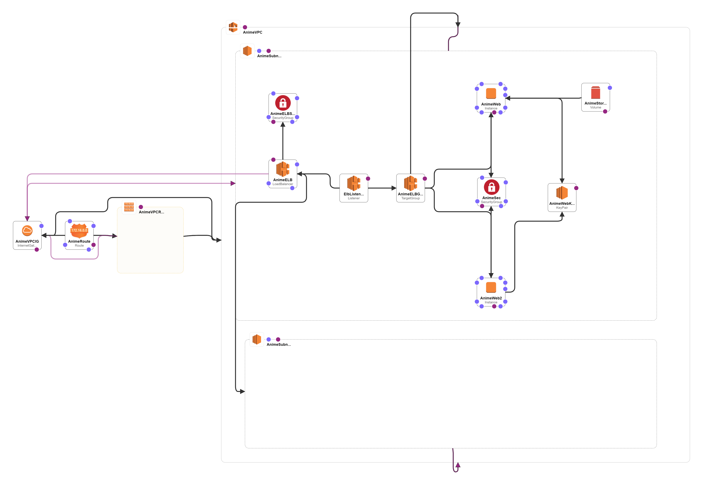

# AnimeWebCloudFormation with VPC
Instructions:
- Create a VPC and two subnets public and private. 
- Deploy to WebServer and use Elastic Load Balancer to distribute traffic 
## Mentor

**Ritesh Behal**

## AWS Resources
* VPC
  * ElasticLoadBalancingV2::LoadBalancer
    * TargetGroup
    * Listener
    * SecurityGroup
  * Route
  * RouteTable
  * SubnetRouteTableAssociation
  * Public Subnet
    * EC2
      * Volume
    * EC2
    * SecurityGroup
    * KeyPair
  * Private Subnet

* InternetGateway
* VPCGatewayAttachment
## References
- [Webserver GitHub Repository](https://github.com/falselunatic/Anime)
- AWS CloudFormation documentation: https://aws.amazon.com/cloudformation/

- AWS CloudFormation templates documentation: https://docs.aws.amazon.com/AWSCloudFormation/latest/UserGuide/template-reference.html

## Diagram

## Authors

- [@sky9262](https://www.github.com/sky9262)

## 🔗 Connect with me

