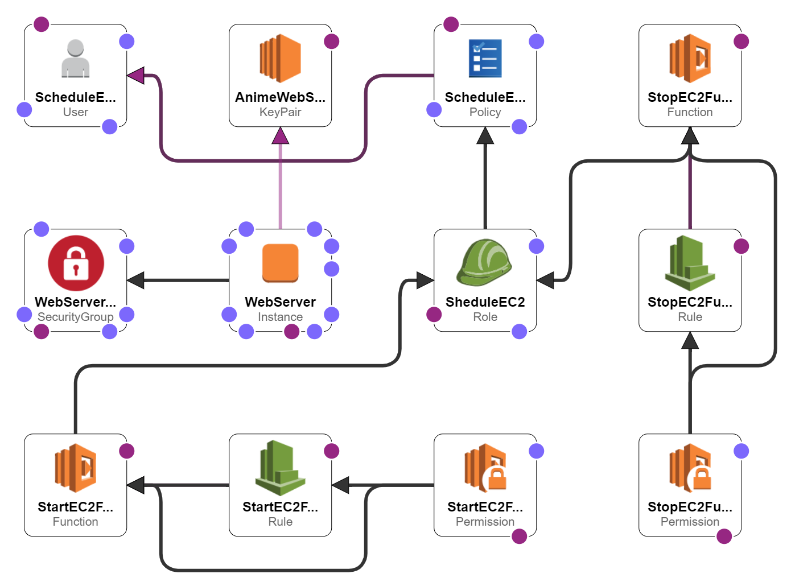

# Schedule EC2 CloudFormation
Instructions:
- Deploy a EC2 Webserver. 
- Schedule it to start at 10 AM and stop it at 06 PM.
## Mentor

**Ritesh Behal**

## My Conclusion 

First of all, I am deploying a webserver as my previous assignment and shutting down it just after initiated.

Creating two Lambda functions to parsing all instances having a tag `key: Env` `value: Scheduled10AMto06PM` then start or stop the webserver and triggering it using EventBridge (CloudWatch Events)

## AWS Resources
* EC2
* SecurityGroup
* KeyPair
* IAM::User
    * Role
    * Policy
* Lambda::Function (Start)
    * Lambda::Permission
    * Events::Rule 
* Lambda::Function (Stop)
    * Lambda::Permission 
    * Events::Rule 
## References
- [Webserver GitHub Repository](https://github.com/falselunatic/Anime)
- AWS CloudFormation documentation: https://aws.amazon.com/cloudformation/

- AWS CloudFormation templates documentation: https://docs.aws.amazon.com/AWSCloudFormation/latest/UserGuide/template-reference.html

## Diagram

## Authors

- [@sky9262](https://www.github.com/sky9262)

## 🔗 Connect with me

