# **Managing tightly coupled architecture using Amazon SQS**

### **Course-end Project 1**

**Description:** Use AWS SQS to manage a tightly couple architecture.

**Tools required:** AWS Services: SQS, EC2, IAM, and RDS


# **Sol:**

I will do it using just 4 major steps:-

1. Create and Configure Amazon RDS.
2. Create Amazon SQS Queue.
3. Create AIM Role.
4. Create two EC2 Instance.

## **Step 1**

**Create and Configure Amazon RDS**

- Create New Amazon RDS 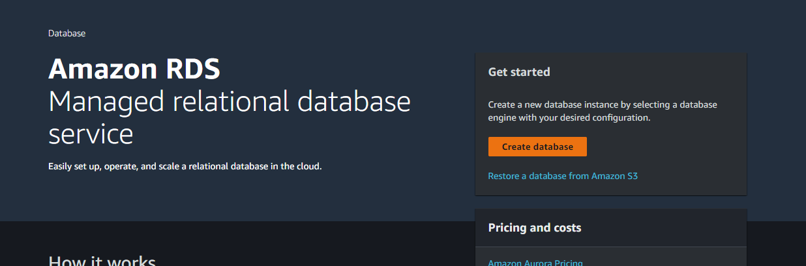

- Select `MySQL` . 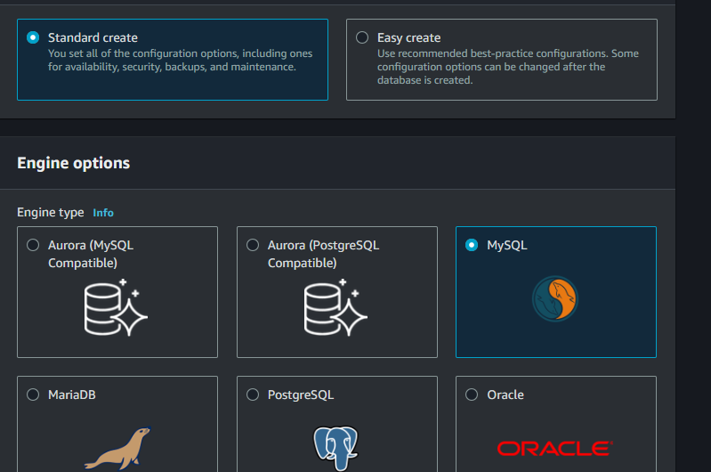

- Select `Free tier`. 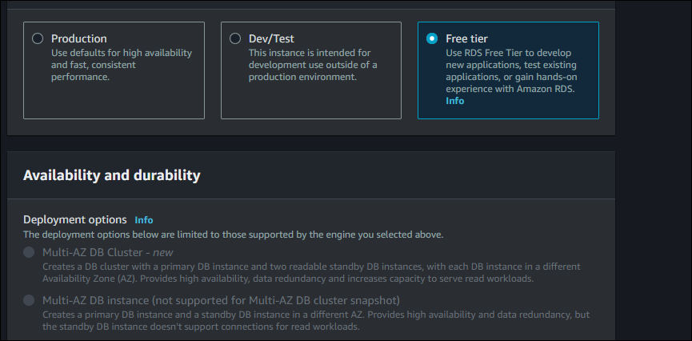

- Enter DataBase Instance name, Master username and Master password. 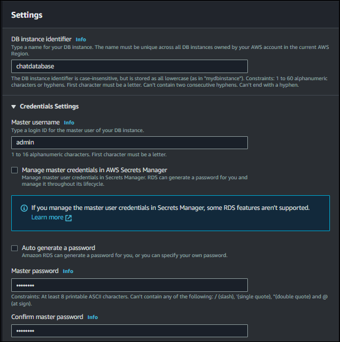

- Enable Public Access. 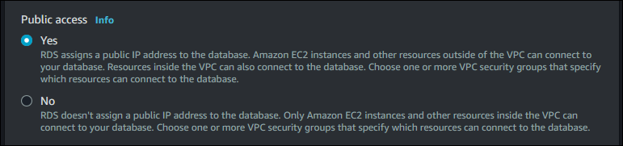


- Select `Password and IAM database authentication`
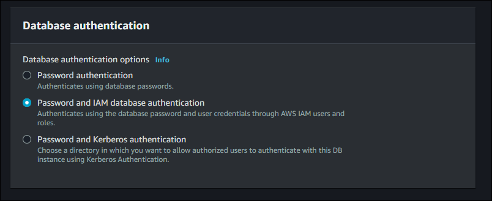


- In Additional configuration, enter Initial database name.
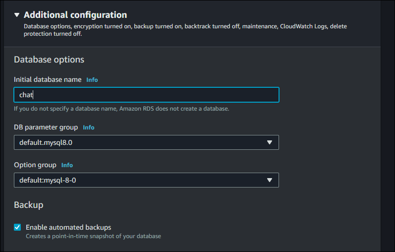

- Now, Create the DataBase.

- Wait for the status `Available` 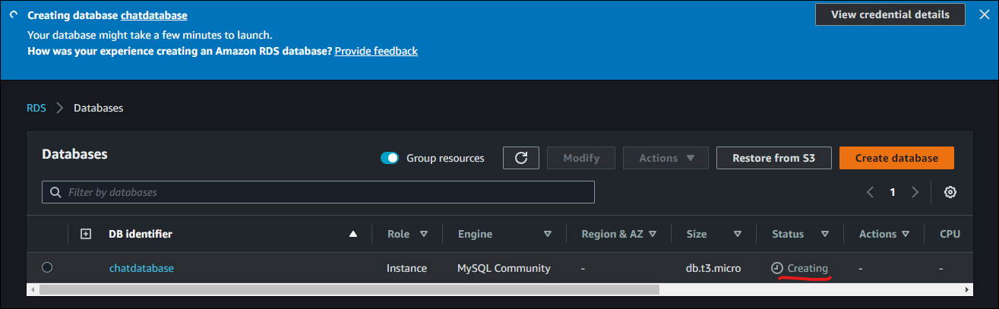

- While it's creating the RDS, create a new security group to allow 3306 port from everywhere.
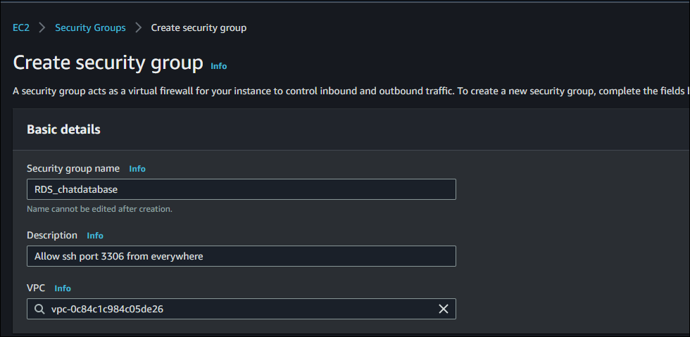
- Add Inbound rule.
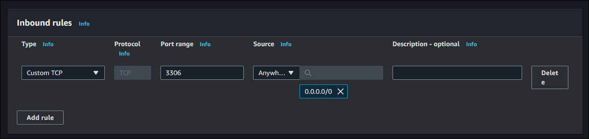

- Create the security group.

- Now, go to the RDS, modify it and change the vpc security group to the new one created.
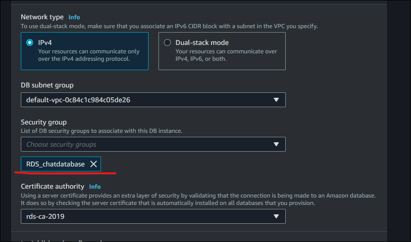

- Do continue and Apply immediately.

- Step 1 completed.


## **Step 2**

**Create Amazon SQS Queue**


- Go to Amazon SQS and create queue.
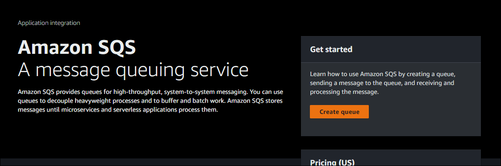

- Enter queue name
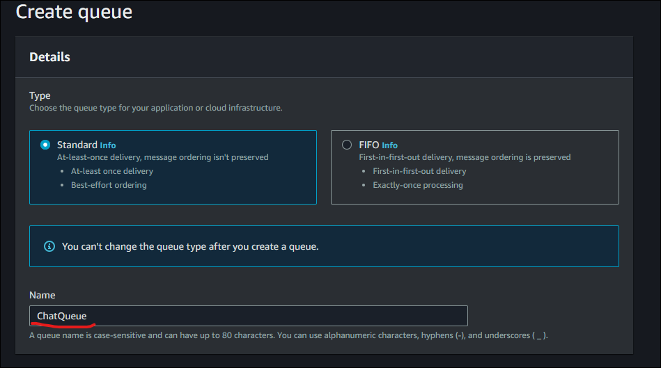
- Leave rest of the options default and create the queue.

- Step 2 completed.


## **Step 3**

**Create AIM Role**

- Now, Open the Amazon AIM and go to Role.

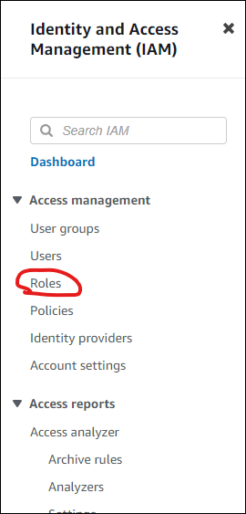

- Create new Role with use case of EC2.

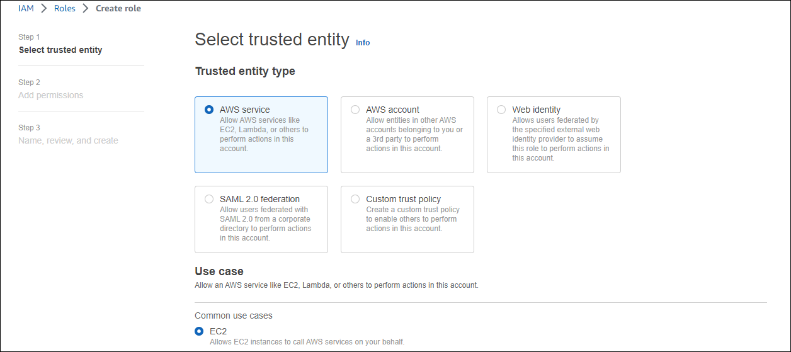

- Here, I'm creating only one Role and giving it to both service's permission `AmazonSQSFullAccess` and `AmazonRDSFullAccess`.
> Note: It's good to create separate roles and give only the permissions required (not full).

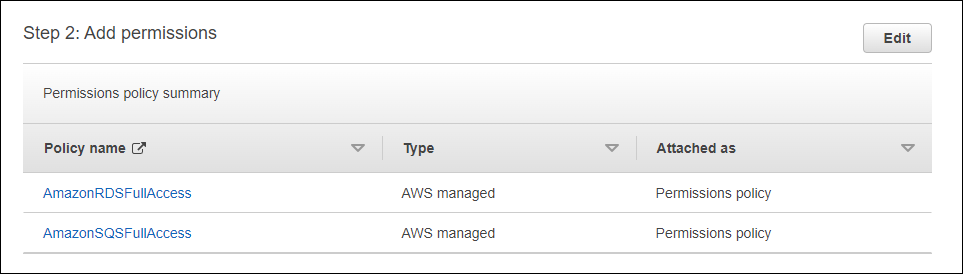

- Enter the Role name and create.

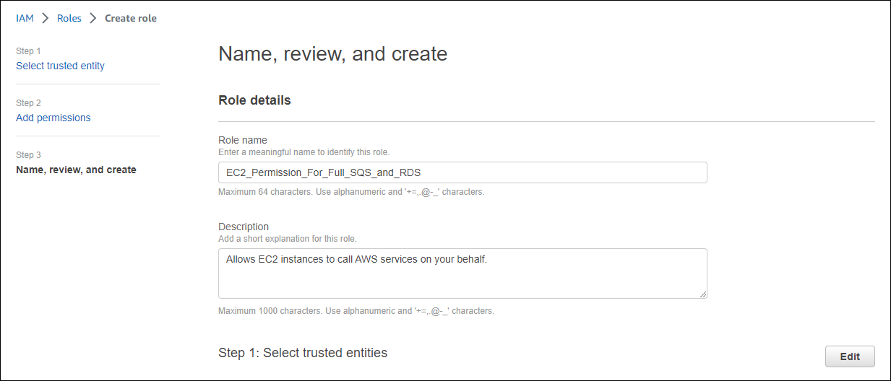

- Step 3 completed.

## **Step 4**

**Create two EC2 Instance**

- Now, let's create two ec2. one for the webserver and one for a python application that will look to the sqs queue and if there is any message it'll send to RDS table and delete the message from the sqs queue.


- Create a WebServer EC2.
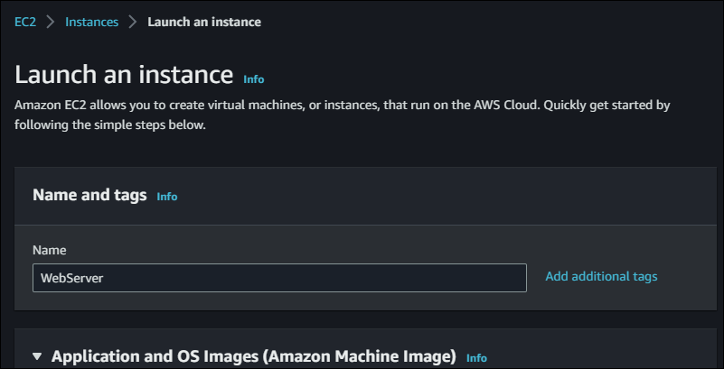

- Allow HTTP and HTTPS traffic from the internet.
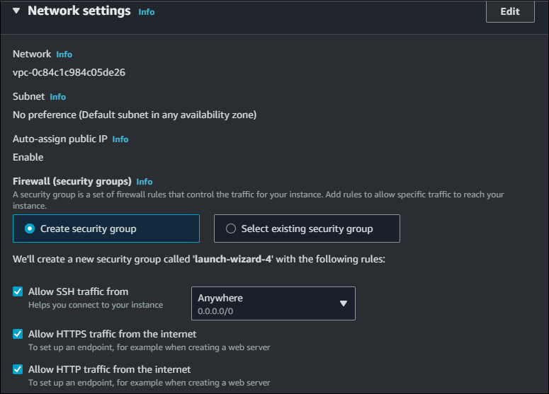

- In Advanced details, select the IAM instance profile created in previous step.
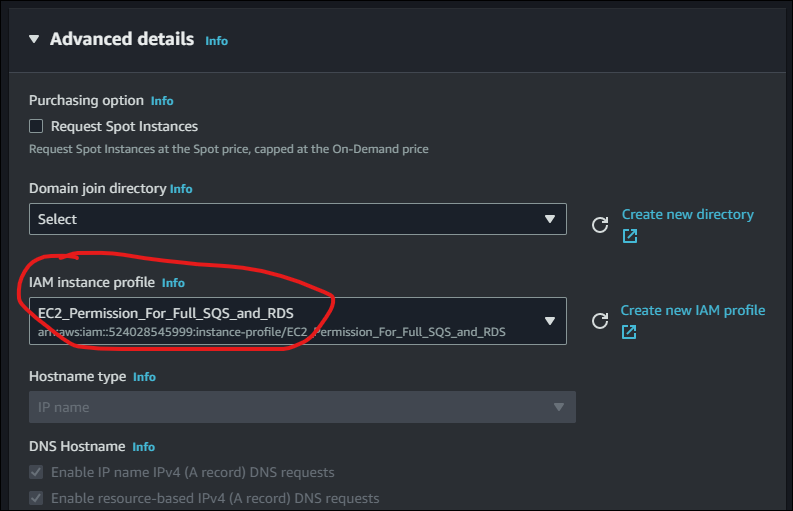

- In User data, add the script below to automatically install webserver and start.
```bash
#!/bin/bash
sudo yum update -y
sudo yum install -y httpd
sudo systemctl start httpd
sudo systemctl enable httpd
sudo curl https://raw.githubusercontent.com/sky9262/AWS-Developer-Associate/main/Projects/Course-end%20Project%201/Code/WebPage.html >> /var/www/html/index.html
```
> Note:- You need to change the following config:


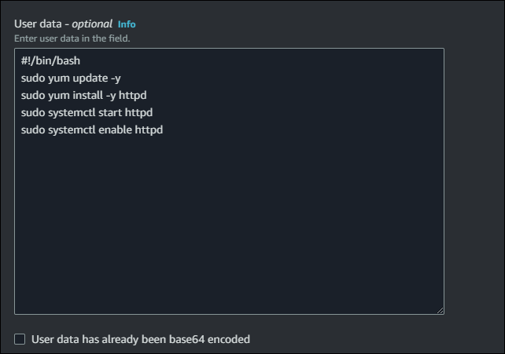

- Create one more instance for the python application using the same way created the previous one but change the user-data.
```bash
#!/bin/bash
pip3 install PyMySQL
pip3 install boto3
curl https://raw.githubusercontent.com/sky9262/AWS-Developer-Associate/main/Projects/Course-end%20Project%201/Code/SQS2RDS.py >> SQS2RDS.py
python3 SQS2RDS.py
```
> Note:- You need to change the following config:


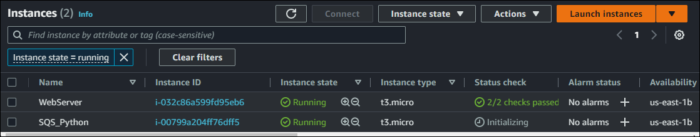


#### Now you can access the website and submit a contact message. It'll send to SQS and the python application take the message and add to the RDS table.

#### If the DataBase is offline the message will still send and when the DataBase will be online all the Messages will be send to RDS table.


**All Done.**


