# **Architecting a website using the Serverless Technology.**

### **Course-end Project 2**

**Description:** Use the serverless technology to build up a feedback website.

**Tools required:** AWS Services - S3, DynamoDB, Cognito, IAM 

**Expected Deliverables:**

- Use Auto Scaling to manage the EC2 instances
- Use EC2 instance and capture the metrics in the CloudW

# **Sol:**

I will do it using just 5 major steps: -

1. Create Amazon Cognito User pool and Identity pool (Federated identities).
2. Configure IAM role.
3. Create Amazon DynamoDB Table.
4. Create Amazon S3 Bucket.
5. Upload static Feedback website to the S3 Bucket.

## **Step 1**

**Create Amazon Cognito User pool and Identity pool (Federated identities)**

- Create New Amazon Cognito user pool 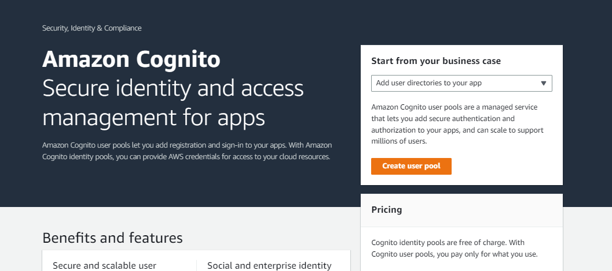

- Select `User name` for sign-in option and click next. 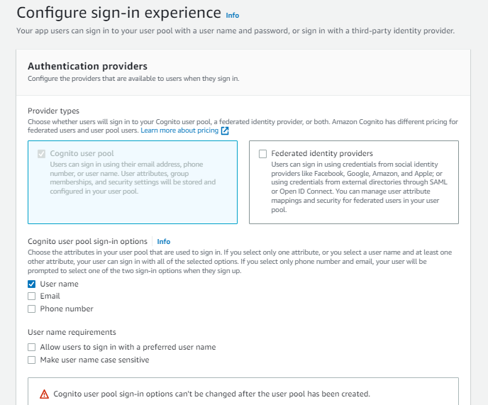

- Here, selection No MFA and leaving rest of options as default and click next. 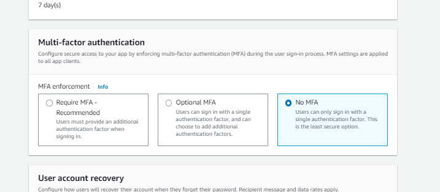

- Leaving everything as default in Step 3 (Configure sign-up experience)

- In the Step 4 (Configure message delivery), Select Send email with Cognito and next. 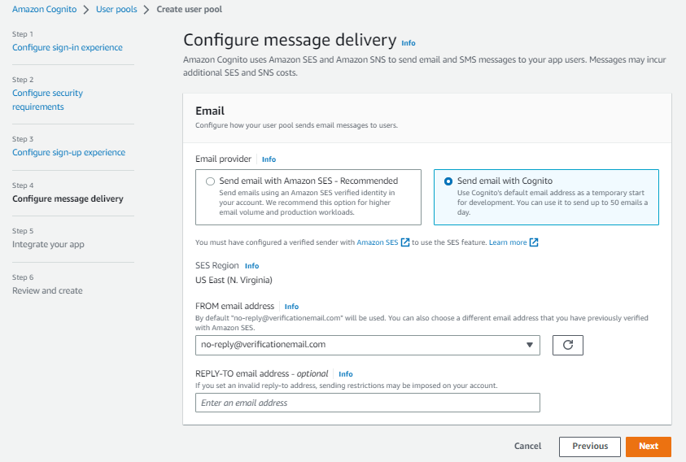

- Naming the User pool as `Feedback` and in the `Initial app client > Client secret` select `Don't generate a client secret` and naming app client as `FeedbackAppClient`. 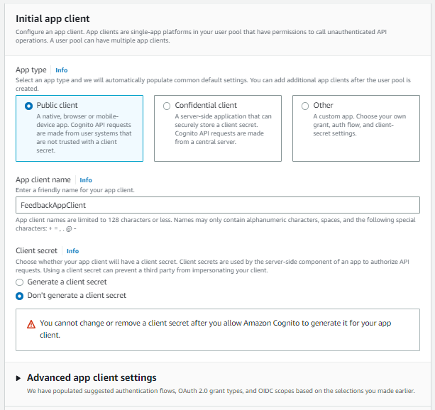


- Create the user pool. After creating the user pool you'll get the `User pool ID`.  <mark>- Checkpoint 1</mark>
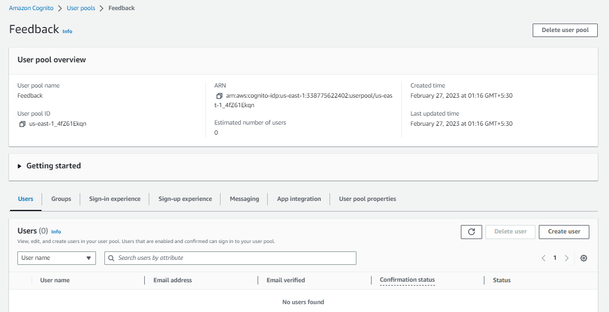


- In the user pool, go to the App integration, scroll down and you'll get the `Client ID`. <mark>- Checkpoint 2</mark>

</br>

- Now, go to the `Federated identities`.
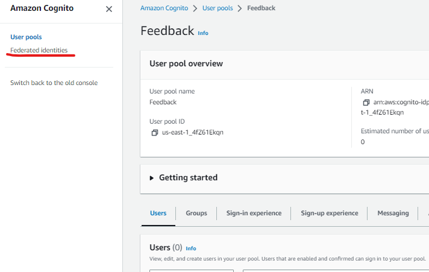

- Create new identity pool naming `FeedbackIdentityPool` and use the `User Pool ID
` and `App client id` got in checkpoint 1 and 2.

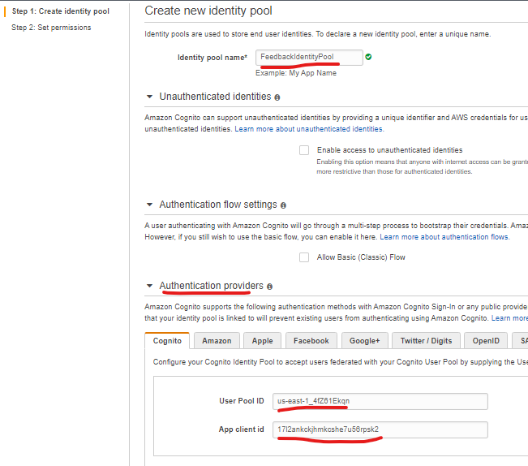

- A new role will be created by default named `Cognito_FeedbackIdentityPoolAuth_Role`. click Allow.
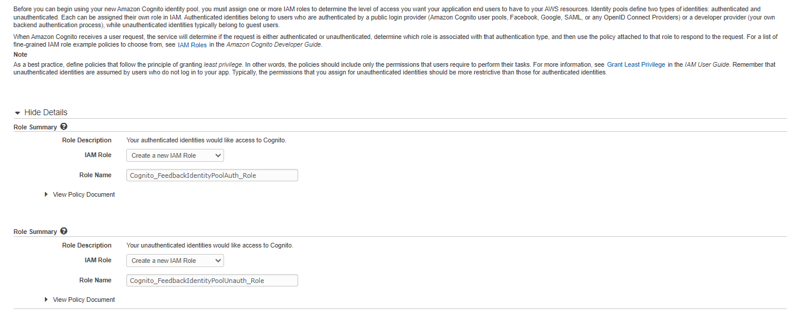

- Here, you'll get your `IdentityPoolId`. <mark>- Checkpoint 3</mark>
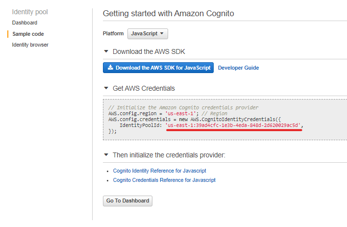


## **Step 2**

**Configure IAM role**


- Go to IAM Roles and search for the role created by default before named `Cognito_FeedbackIdentityPoolAuth_Role `.
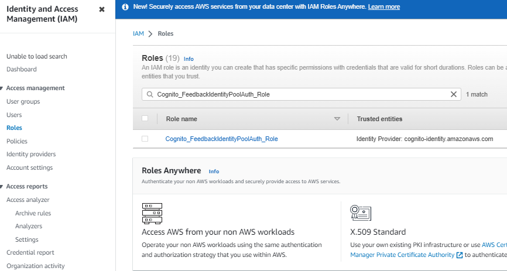

- Add 2 permission (Attach policy) to the role.
  1. `AmazonS3FullAccess`
  2. `AmazonDynamoDBFullAccess`
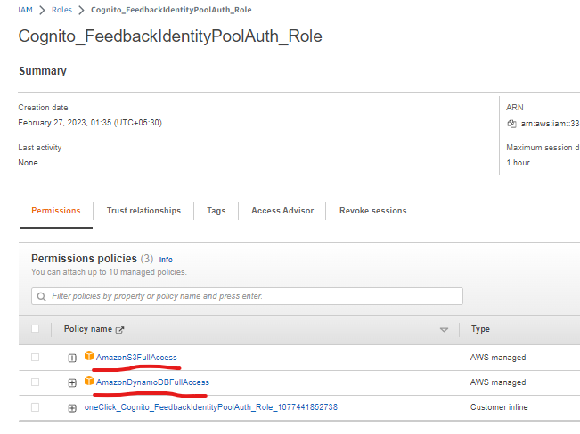
- Selecting the launch template created before and click next

## **Step 3**

**Create Amazon DynamoDB Table**

- Go to DynamoDB nad create table.

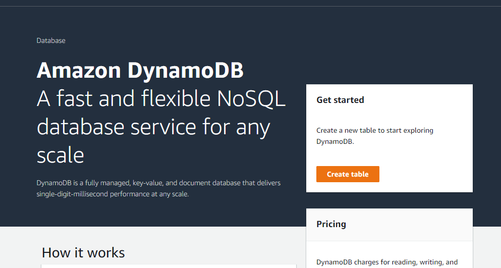

- Naming the table as `Feedback` and in Partition key I'm using email as a primary key.

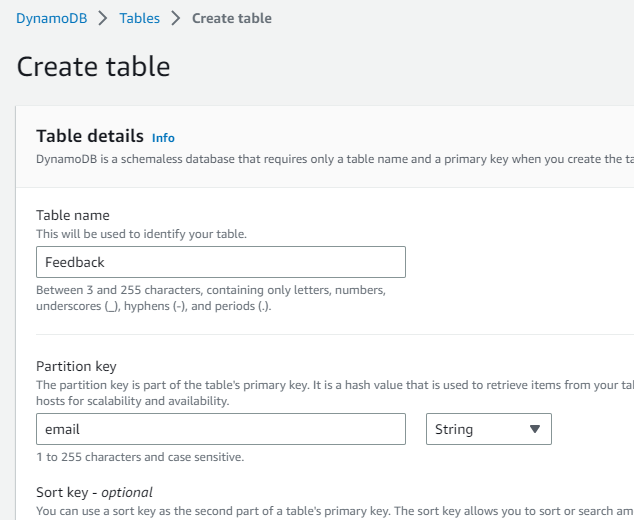

- Leaving rest of options as default.

## **Step 4**

**Create Amazon S3 Bucket**

- Now, go to the Amazon S3 and **Create bucket**
- Naming as `feedbacksky9262`.
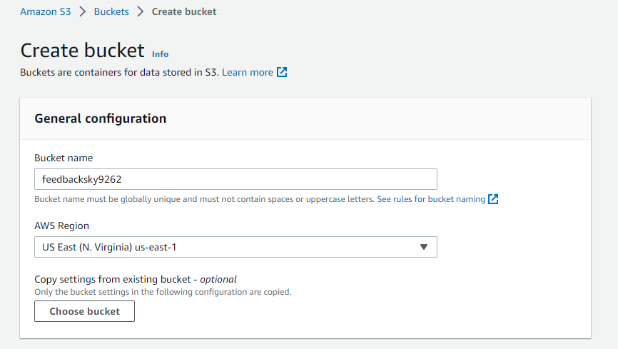

- In Object Ownership, Select `ACLs enabled`.
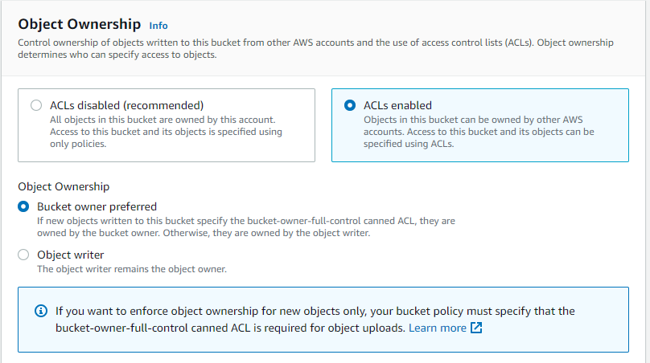

- In Block Public Access settings for this bucket, Unblock two options. Set the permissions as below.
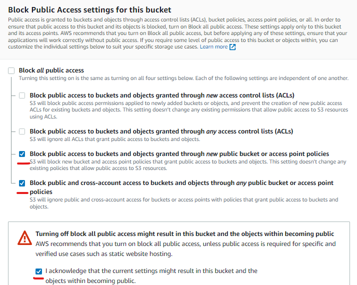

- Leaving the rest of options as default and create the bucket.

- Now, Open the bucket.
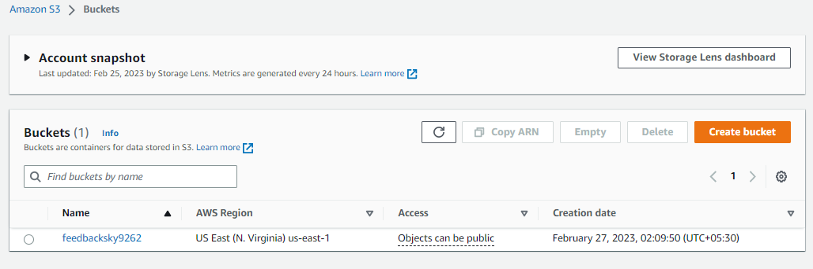

- Go to Permissions, Scroll down and edit `Cross-origin resource sharing (CORS)`.
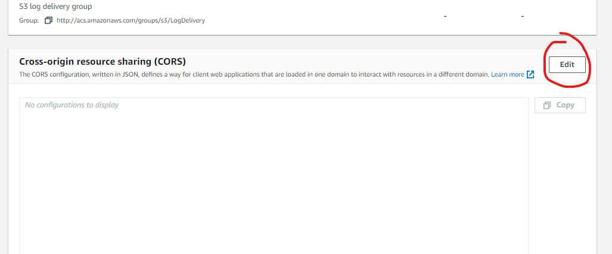

- Paste the below JSON and click “Save”. This will allow cross origin access.

```Json
[
    {
        "AllowedHeaders": [
            "*"
        ],
        "AllowedMethods": [
            "GET",
            "PUT",
            "POST",
            "DELETE"
        ],
        "AllowedOrigins": [
            "*"
        ],
        "ExposeHeaders": []
    }
]
```

- Now, Go to Properties, Scroll down to bottom and edit `Static website hosting`. 
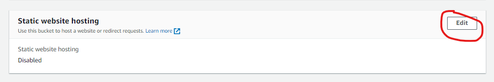
- Enable the Static website hosting and in Index document type `index.html`.
> Note:- index.html will be our homepage.

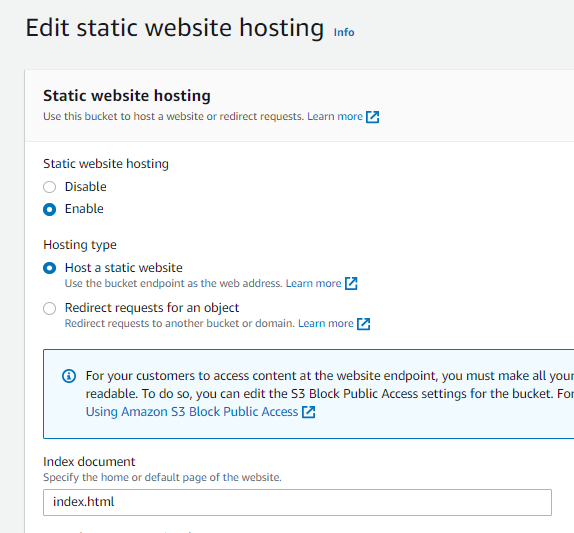

- You'll get the Bucket website endpoint.
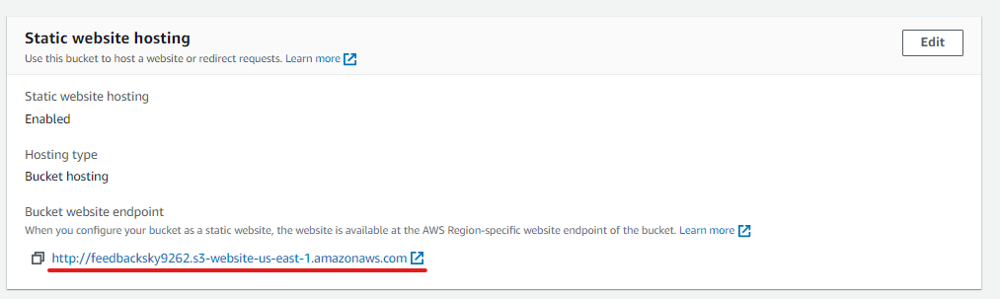


## **Step 5**

**Upload static Feedback website to the S3 bucket**


- Go to this [Github Repo (AWSCognitoFeedbackStaticWeb)](https://github.com/sky9262/AWSCognitoFeedbackStaticWeb) and get the code for the feedback web app. 
> This is an static html page with AWS Javascript SDK included in “script” folder.

<details><summary>Brief explaination of the code</summary>

 * Created 3 pages. 
   * __Home page ([index.html](https://github.com/sky9262/AWSCognitoFeedbackStaticWeb/blob/main/index.html))__: Feedback form
   * __Login page ([login.html](https://github.com/sky9262/AWSCognitoFeedbackStaticWeb/blob/main/login.html))__: Login the user with email id and password.
   * __Signup page ([signup.html](https://github.com/sky9262/AWSCognitoFeedbackStaticWeb/blob/main/signup.html))__: Signup new user.
 * Used `Javascript SDK` to Signup and Login and after the login, getting user creds to submit the form to DynamoDB table.
 * The website's background image will be randome image everytime you visit it.
</details>

- Now, Download the repo and edit the files.

> **Important step**: 
>- Change AWS IDs in the `index.html`, `login.html` and `signup.html` file with the values got in <mark> checkpoint 1, 2 and 3 </mark> and you can also customize the website according to you.
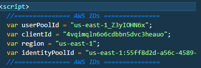

- Upload the files to the S3 bucket
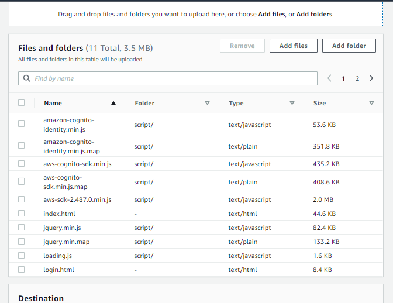

- After uploading the files, select all files click on Action button and Make public using ACL.
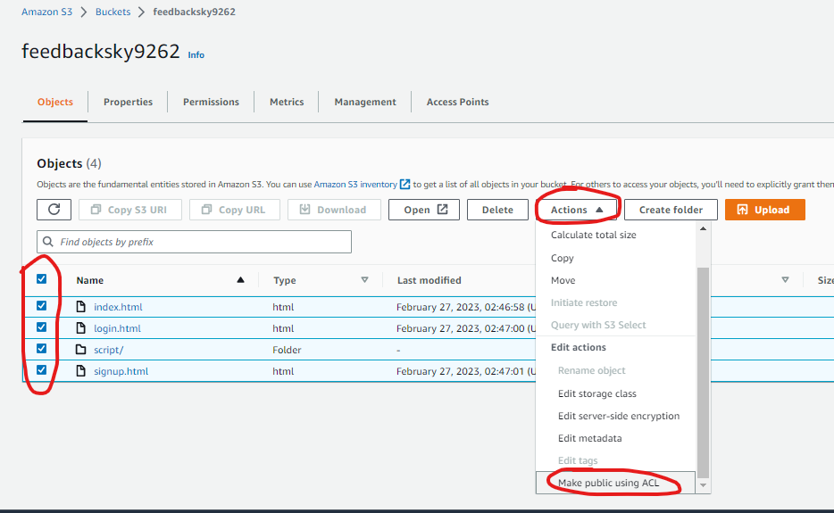

#### Now you can access the website and submit a feedback with Serverless Technology.

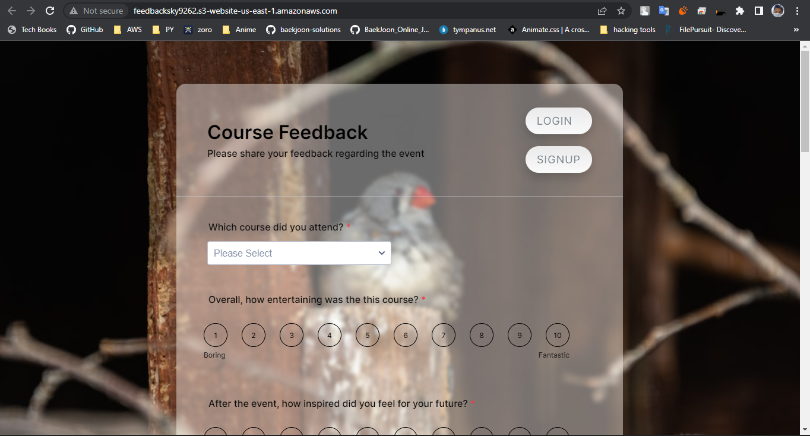

**All Done.**


