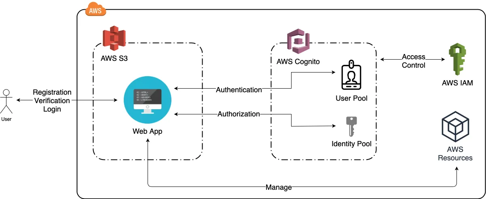

# **Architecting a website using the Serverless Technology.**

### **Course-end Project 2**

**Description:** Use the serverless technology to build up a feedback website.

**Tools required:** S3, Cognito, IAM, DynamoDB

##### we will use the `serverless` technologies to build up a feedback website. The services to be used and their purpose are listed below:

- S3 – For storing the web pages
- DynamoDB – For storing the feedback results
- Cognito – To provide the website access to the backend database
- IAM – To specify what permissions to be given

### Expected Deliverables:

- Use Serverless technology to create a feedback form
- Store the results in DynamoDB for further analysis

#### Solved in two ways:

AWS Console            |  CloudFormation
:-------------------------:|:-------------------------:
  |  

## AWS Resources
- AWS S3
- DynamoDB
- Cognito
- IAM

 

## References
- AWS S3 documentation: https://docs.aws.amazon.com/s3/index.html

- AWS DynamoDB documentation: https://docs.aws.amazon.com/dynamodb/index.html

- AWS Cognito documentation: https://docs.aws.amazon.com/cognito/index.html

- AWS Identity and Access Management documentation: https://docs.aws.amazon.com/iam/index.html

## WorkFlow

## Authors

- [@sky9262](https://www.github.com/sky9262)

## 🔗 Connect with me

