# **Scaling the EC2 Instance Based on Monitored CloudWatch Metrics**

### **Course-end Project 3**

**Description:** Use Auto Scaling to manage the EC2 instances and use EC2 instance and capture the metrics in the CloudWatch.

**Tools required:** AWS Services - CloudWatch, Auto Scaling, EC2

**Expected Deliverables:**

- Use Auto Scaling to manage the EC2 instances
- Use EC2 instance and capture the metrics in the CloudW

# **Sol:**

I will do it using just 4 major steps: -

1. Create templates for our EC2 instance.
2. Create Auto Scaling Group using that template.
3. Create two Cloud Watch Alarms.
4. Final Configuration.

**Step 1**

**Create templates EC2 instance**

- Create New Launch Template 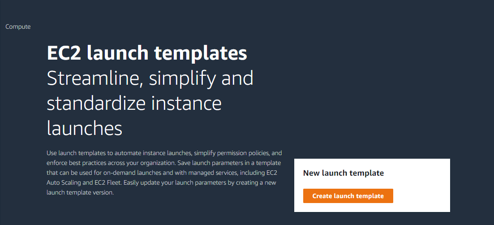

- Naming it as `CWAutoScaleEC2`
- Choosing my OS as `Amazon Linux` and instance type `t3.micro`
- Creating Key Pair named `CW_AS_EC2`
- Creating new security group and allow **SSH** to access it.
- Rest of options leaving as default.

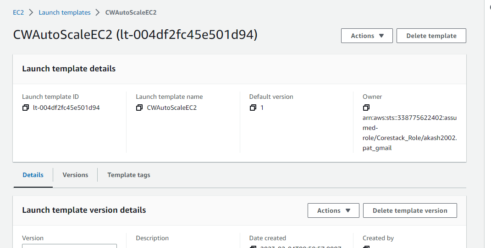

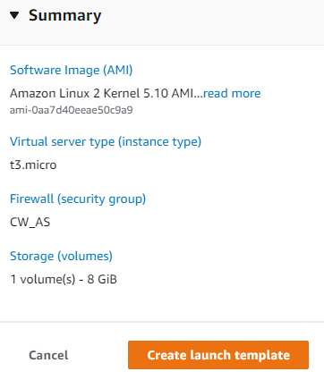

**Step 2**

**Create Auto Scaling Group**

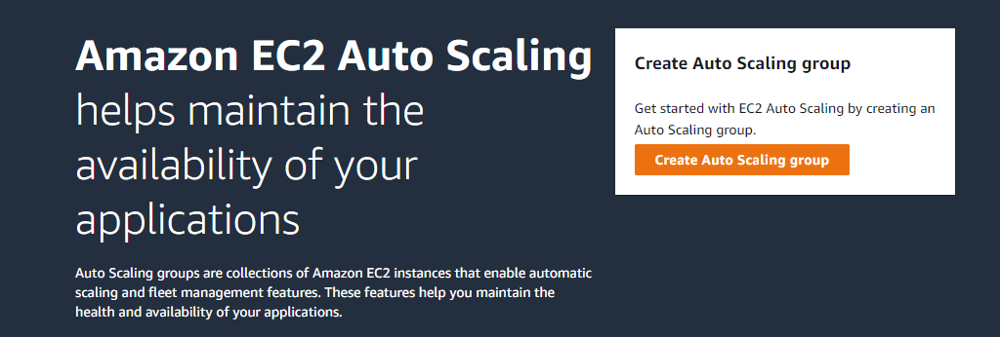

- Create a new Auto Scaling Group named `ASG_CW`
- Selecting the launch template created before and click next

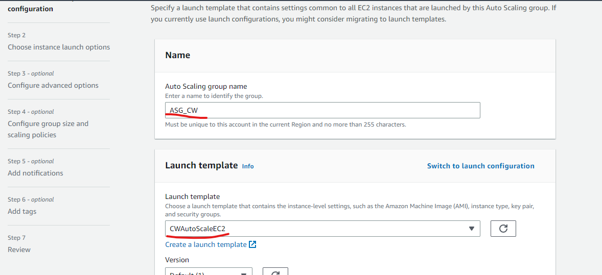

- Leaving VPC as default and selecting any subnet

- In step 4 Group size, enter Maximum capacity of instances in this group, Minimum capacity, and Desired capacity

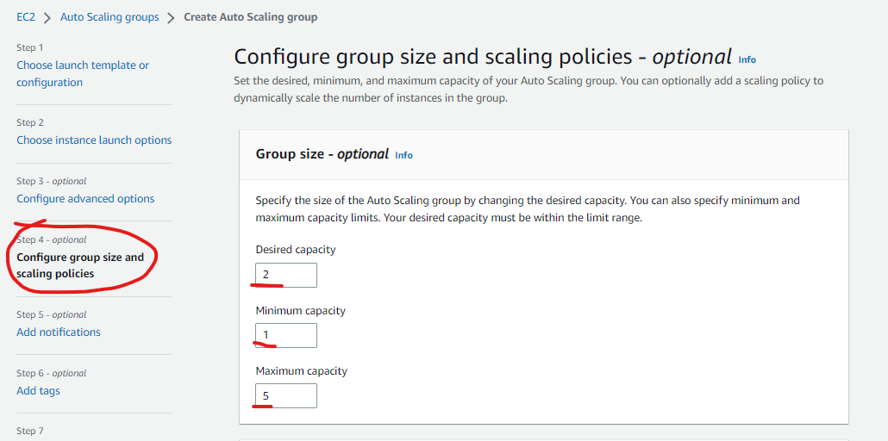

- Leaving rest of the options (3,4,5) as default and click create auto scaling group.

**Note:** It'll create a new instance using the selected launch template.

**Step 3**

**Create two Cloud Watch Alarms**

- Open cloudwatch, go to `Alarms > In alarm` and create a new alarm

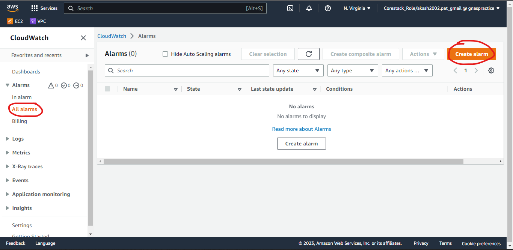

- In Matric Graph select matric

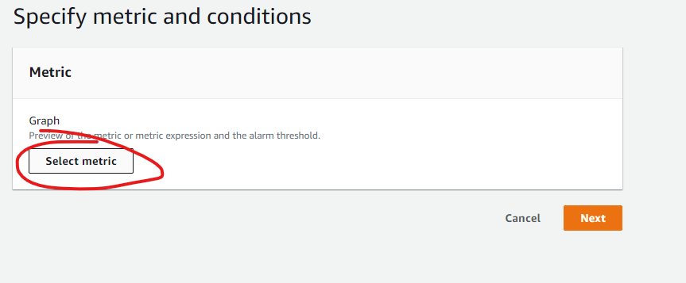

- Here in Metric select EC2

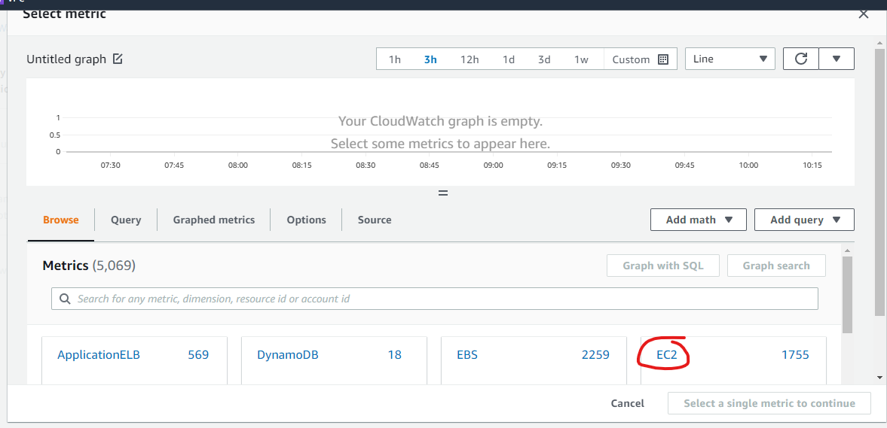

- Now, select `By Auto Scaling Group`

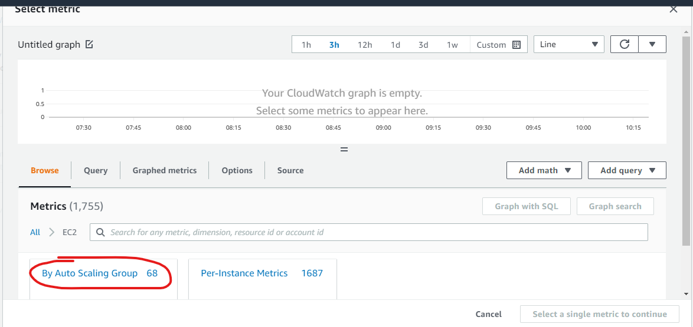

- Search for the auto scaling group created before

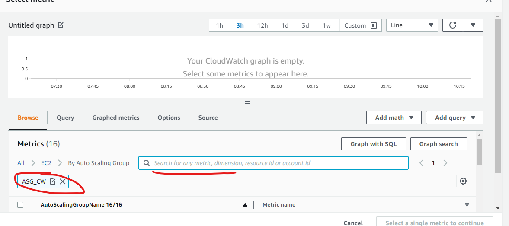

- Now, scroll down and select `CPUUtilazation` matric

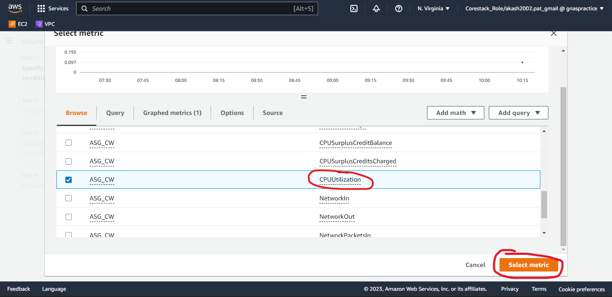

- In the Conditions, enter the value of CPU utilization when the auto scale should scale up and click next

- In notification, create new topic named `CW_AS_Topic` and email-ID and click next

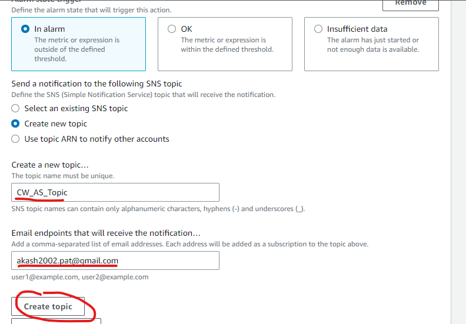

- Named it as `Scale Up`

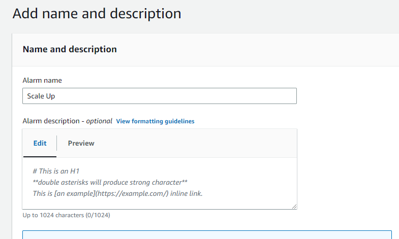

- First Alarm is created for Scale Up. Now, let's create second alarm for Scale Down.

- Now, create second alarm same as before but in Condition, instead of Greater choose Lower and enter a value when the auto scale should scale down

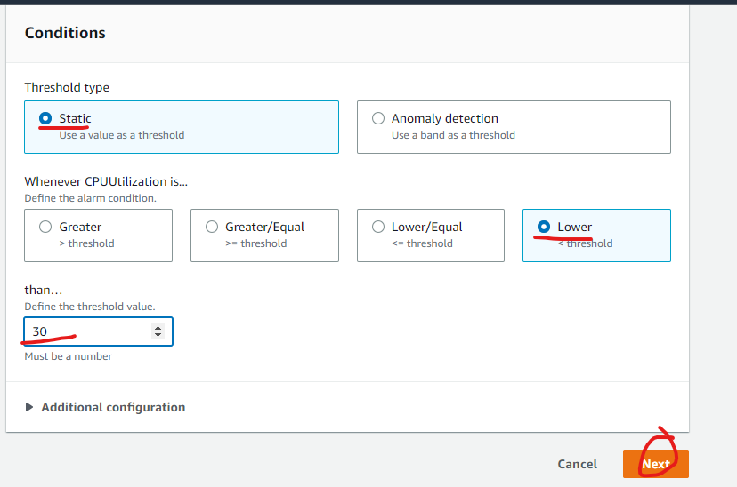

- Now, instead of creating new topic `Select an existing SNS topic` and select the topic created before

- Named it as `Scale Down` and create it.

**Now, I have two alarm one for scale up when CPU utilization is more than 75% and second one for scale down when CPU utilization is less than 30%.**

**Step 3**

**Final Configuration**

- Now, go to the scaling group created before and `Create Dynamic Scaling Policy`
- In Policy type, select `Simple scaling`
- Named it as `ScaleUp`
- Choose the Scale Up CloudWatch alarm
- In Take the action option, choose Add and enter the number of instances want to create.
- In Take the action option, choose instead of capacity units choose `Percent of group`

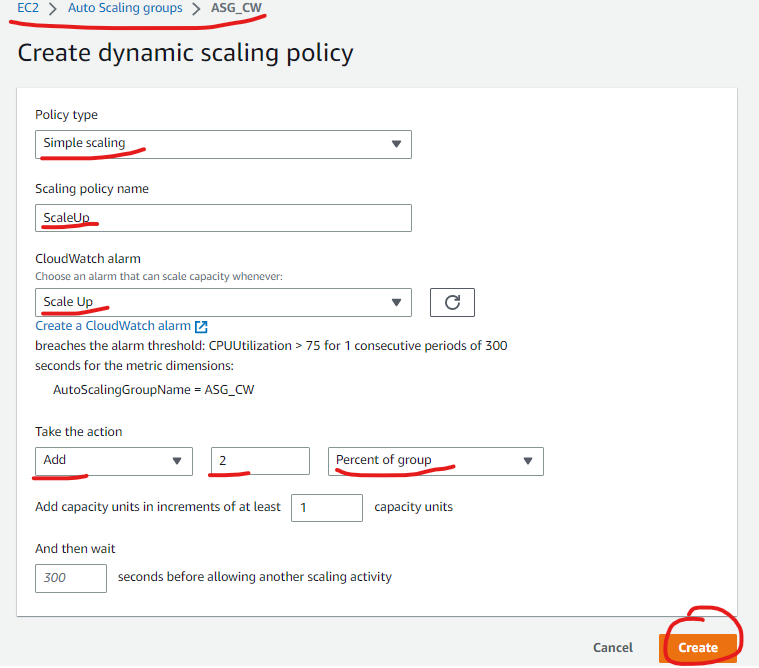

- Now, create one more dynamic scaling group for scale down same as sawn below

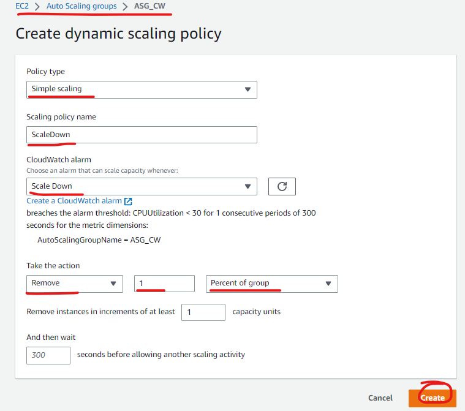

**All Done.**

**Now, connect to the instance created by default during auto scaling group.**

**Connect to times to the instance one to keep tracking its CPU usages and one for Spike up the instance.**

1. **Use** `top –I` **command to track.**
2. **Use** `yes \> /dev/null | yes \> /dev/null` **command to spike up cpu utilization.**

**Result:** It'll add two instances in the group when the average CPU utilization of the group will be greater than 75% and when the average CPU utilization of the group will be lower than 30% it'll remove one instance from the group.

