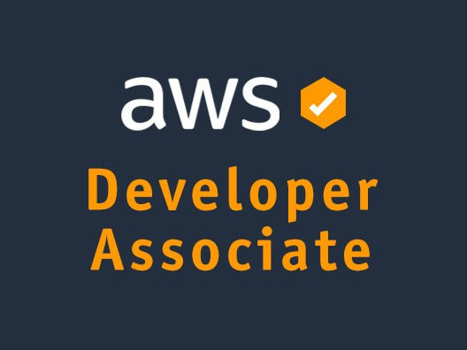

Hi, Dear

My name is Akash and I am having AWS Developer Associate Certification Training through Simplilearn. I will upload here all the resources used or created during the Certification.

## References
- Simplilearn: https://www.simplilearn.com/cloud-computing/aws-developer-certification-training

## Authors

- [@sky9262](https://www.github.com/sky9262)

## 🔗 Connect with me

